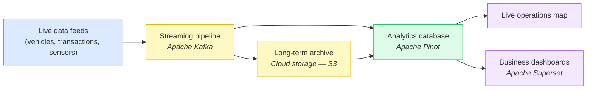

# Data Operations Center — Business Overview

## In one sentence

A platform that takes data arriving continuously — thousands of events a second, around the
clock — and makes it answerable **immediately**: a live operations map, self-service dashboards
for the business, and years of history kept cheaply and still queryable.

---

## How it works

Four moving parts, and only one of them is unfamiliar to most organisations:

1. **The streaming pipeline** carries every event away from the system that produced it, so
   analytics never slows down the business application it came from.
2. **The archive** keeps the raw history in cloud object storage — the cheapest durable storage
   available — instead of on a database disk you pay for, resize and back up.
3. **The analytics database** it answers questions over the live stream and the archive through
   **one SQL interface**, so "what is happening right now" and "what happened last year" are
   the same query language, the same tool, the same dashboard.
4. **The front ends** — a purpose-built map for the operations floor, and a drag-and-drop
   dashboard tool for everyone else, so analysts answer their own questions without raising a
   ticket to engineering.

Behind these, a standard monitoring stack watches the platform's own health and collects every
component's logs in one searchable place.

---

## Why not just use a relational database?

A relational database is excellent at what it was designed for:
being the **system of record**. Recording an order, updating a customer, guaranteeing that money
moved exactly once. This platform does not replace that, and is not meant to.

The trouble starts when the same database is also asked to answer analytical questions over
hundreds of millions of accumulated events. The outcome is familiar: dashboards get slower every
month.

This platform removes that layer of workarounds, because the database underneath is built for the
question rather than patched into answering it.

| The business question                      | Traditional relational database                                                      | This platform                                                                        |
|--------------------------------------------|--------------------------------------------------------------------------------------|--------------------------------------------------------------------------------------|
| "Chart this across 60 million events."     | Seconds to minutes — fast only if someone pre-built and scheduled a summary table    | **~0.2 s**, measured on the live system, with nothing pre-built                        |
| "Is what I'm looking at current?"          | As fresh as the last overnight load                                                  | Queryable **seconds** after the event happens                                          |
| "We added another year of data."           | Every report gets slower — scans grow with the table                                 | Dashboard cost stays **flat**; running totals are maintained as data arrives           |
| "Thirty people just opened the dashboard." | Analytical queries compete with the transactions that run the business               | Built for many concurrent users, on its own copy — the source system is never touched  |
| "Where is every vehicle *right now*?"      | A scan across all history, or a second table the application must keep in sync       | A plain one-line query — the database itself keeps one current row per vehicle         |
| "Keep three years of history."             | Grows the disk you provision, back up and pay for                                    | Old data lives in cheap cloud storage, still queryable through the same SQL            |
| "Can we trust the incoming feed's format?" | A change at the source breaks the report; you find out from the report               | Malformed events are **rejected at the source** by an enforced data contract           |

### Where a relational database is still the right answer

Worth stating plainly, because the honest version is the more useful one:

- transactions, and anything that must be updated or deleted record by record
- complex joins across many related tables, and referential integrity
- anything under a few million rows, where a relational database is simply fast enough

The two sit **side by side**: the relational database runs the business, this platform answers
questions about it.

---

## What that buys the business

**1. Decisions on current data, not yesterday's extract.**
Nothing on screen comes from a cache — every dashboard panel and map query is computed live from
the data at the moment you look. Each panel even prints the time its own query took, so
performance is visible rather than claimed.

**2. Speed that survives growth.**
Measured on the live system: a filtered question over **60.4 million rows returns in 172 ms**. That
figure does not degrade as history accumulates, because the database maintains pre-aggregated
summaries as data arrives — the work happens once on the way in, not on every dashboard view.

**3. One platform, two audiences.**
Operations get a live map: every vehicle in the city refreshed every 10 seconds, click a vehicle
to see its route and progress, click a stop to see real departure times against the timetable. The
business gets self-service dashboards over the same data — on-time performance by route, problem
vehicles, congestion hotspots, rush-hour patterns — built by dragging fields, not by writing code.

**4. History that costs almost nothing to keep.**
Capacity is a cloud storage line item rather than a disk to resize, so "how long do we keep this?"
becomes a business decision instead of an infrastructure constraint.

**5. No vendor lock-in and no per-query bill.**
Every component is open source. There are no per-seat, per-query or per-terabyte licence fees,
unlike managed analytics platforms that charge for each dashboard refresh. The recurring cost is
the cloud instance it runs on, plus storage.

**6. It runs where you need it.**
The whole stack starts on a laptop for a demo, runs on a single cloud instance in production, and
is being prepared for Kubernetes — the same components in all three, so nothing is re-learned or
rebuilt when it moves.

---

## Proof: a working example

The platform runs live against **Gdansk's public transport network** — the GPS feed of every bus
and tram in the city, arriving continuously and accumulated past 60 million position records. Real,
messy, public data, not a synthetic benchmark.

Questions it answers today, on demand:

- Which routes have the worst on-time performance — and is it the trams, the buses, or the night services?
- Which individual vehicles are chronic offenders?
- Where does the network congest, shown on a map of the city?
- How does traffic volume shift hour by hour through rush hour?
- How has average delay per route trended, day by day?
- Where is a given vehicle right now, and when does it actually reach my stop?

A second feed — financial trade events — runs alongside it to demonstrate **enforced data
contracts**: a producer that sends data in the wrong shape is rejected immediately, rather than
discovered weeks later as a broken figure in a report.

Change the data source and the same questions become: which depots run late, which machines drift
out of tolerance, where transactions cluster. The pattern is the product.

---

## Bottom line

Any database can store events. This platform makes tens of millions of them answerable in a
fraction of a second, live, at a cost that is mostly just storage — so the business can question
its operational data continuously, instead of waiting for a report to be built.
