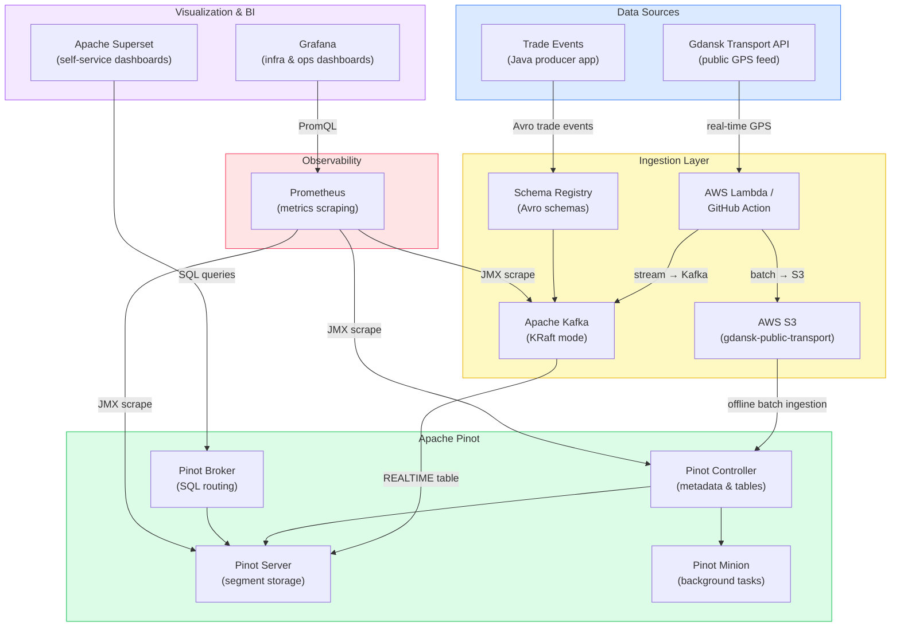

# Data Operations Center — Business Overview

## What It Is

A **real-time + batch data analytics platform** that collects, streams, stores, and visualizes operational data — built entirely on open-source, cloud-ready components.

---

## Two Live Use Cases

| Use Case                    | Data Type                                                      | Ingestion Mode                                    |
|-----------------------------|----------------------------------------------------------------|---------------------------------------------------|
| **Financial Trade Events**  | Stock trade activity (symbol, side, quantity, timestamps)      | Real-time streaming via Kafka                     |
| **Gdansk Public Transport** | GPS positions, delays, speeds, routes for all city buses/trams | Both: live stream (Kafka) + historical batch (S3) |

---

## Architecture Diagram

---

## Key Business Advantages

**1. Sub-second query latency on millions of rows**
Apache Pinot is purpose-built for OLAP at scale — queries that would take minutes in a traditional database return in milliseconds, even over tens of millions of GPS snapshots.

**2. Unified real-time + historical data**
The same SQL interface queries both live streaming data (what buses are doing *right now*) and historical batch data from S3 — no separate pipelines or tools needed.

**3. Schema-governed data contracts**
Kafka Schema Registry with Avro enforces that every producer writes data in the agreed format. Broken or malformed events are rejected at the source, not discovered weeks later in a report.

**4. Self-service analytics for business users**
Apache Superset gives non-technical stakeholders a browser-based SQL and dashboard interface — no need to involve engineering for every data question.

**5. Full observability stack included**
Prometheus scrapes metrics from every component; Grafana dashboards give operations teams visibility into Kafka throughput, Pinot segment health, and query latency — all in one place.

**6. Cloud-portable and Kubernetes-ready**
The entire platform runs in Docker Compose (for dev/demo) or Kubernetes (for production). Moving from laptop to cloud is a configuration change, not a rewrite.

**7. Cost-effective open-source stack**
Every component (Kafka, Pinot, Superset, Grafana, Prometheus) is 100% open-source with no per-seat or per-query licensing fees — unlike managed SaaS alternatives (Snowflake, Splunk, etc.).

---

## What Kind of Analytics Does It Enable?

From the Gdansk transport use case, examples of business questions it can answer in real time:
- Which routes have the worst on-time performance? (by %, P90/P99 delay)
- Which individual vehicles are chronic offenders?
- Where are GPS congestion hotspots on the city map?
- How does rush-hour traffic volume compare hour by hour?
- How has average delay per route trended day by day?

---

## Deployment Modes

| Mode | How | Who For |
|---|---|---|
| Dev / Demo | Docker Compose, single machine | Local testing, demos |
| Production | Kubernetes (Kustomize), container images on Docker Hub | Cloud or on-prem production |

---

## Core Message

This platform turns raw event streams into queryable, dashboarded insights in under a second, at any scale, without vendor lock-in.